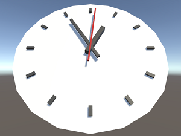
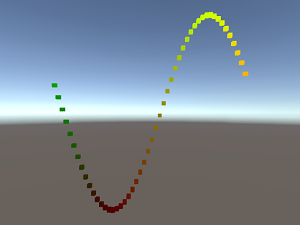

# CatlikeCoding
For [Catlike Coding Unity Tutorials](https://catlikecoding.com/unity/tutorials/)

## WebGL builds
<table>
  <tr>
    <td colspan="2">Basics</td>
  </tr>
  <tr>
    <td> Game Objects and Scripts</td>
    <td> Building a Graph</td>
  </tr>
</table>
