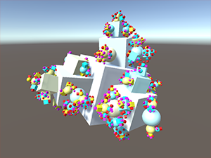

# CatlikeCoding
For [Catlike Coding Unity Tutorials](https://catlikecoding.com/unity/tutorials/)

## WebGL builds
<table>
  <tr>
    <td colspan="3"><a href="https://catlikecoding.com/unity/tutorials/basics/">Basics</a></td>
  </tr>
  <tr>
    <td> Game Objects and Scripts &nbsp;</td>
    <td> Building a Graph &nbsp;</td>
    <td> Mathematical Surfaces +  Measuring Performance</td>
  </tr>
  <tr>
    <td> Compute Shaders</td>
    <td> Jobs</td>
    <td> Organic Variety</td>
  </tr>
  <tr>
    <td colspan="3">Miscellaneous</td>
  </tr>
  <tr>
    <td> Constructing a Fractal</td>
  </tr>
</table>
